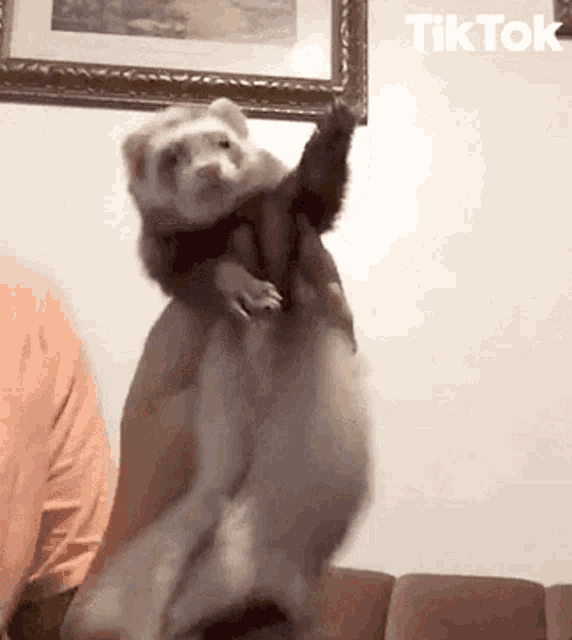
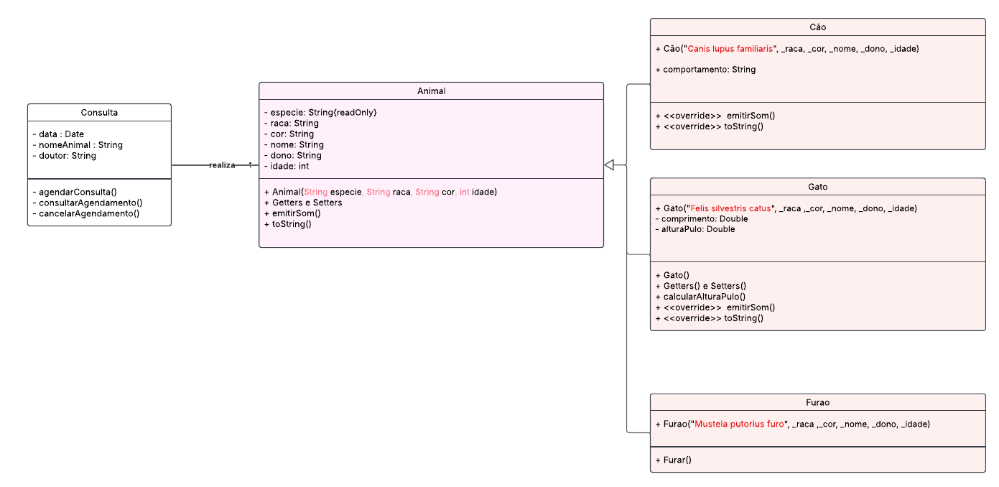

 

 

 <h1> 🚀 Descrição do Exercício </h1>

- Desenvolver um **sistema baseado em herança em Java**, escolhendo um tema de sua preferência. 
- A atividade deve ser feita em trio.
- Pontuação: **2 pts**.
- Entrega: 📅 **16/03** até 🕔 **23:59**
  - No Ulife, colocar o link do repositório e o nome e ra dos alunos.
  - Obs:
    - o repositório deve ser público ou se privado adicionar **rafapcmor**,
    - somente 1 aluno posta no Ulife. 

### 🎯 Objetivos

- Escolher um **tema** para o projeto.
- Criar uma estrutura de **herança** com pelo menos:
  - **Uma classe base (superclasse)**
  - **Duas classes derivadas (subclasses)**
- Implementar o código de forma colaborativa, utilizando **GitHub Flow**:
  - **Branches (`main` e `dev`)**
  - **Branches individuais para cada funcionalidade (`feature/...`)**
  - **Pull Requests e revisão de código**
- No final, desenvolver um programa **`Main.java`** para testar o sistema.

## 🏗️ Estrutura do Projeto
1. Escolha um tema que envolva pelo menos **três tipos de entidades similares**.  
2. A classe base deve conter **atributos e métodos comuns** a todas as subclasses.  
3. Cada subclasse deve:
   - **Adicionar atributos próprios**
   - **Sobrescrever métodos da superclasse quando necessário** (`@Override`)

## 🔧 Fluxo no GitHub

1. Um dos membros cria o repositório e adiciona os outros como colaboradores.  
2. O dono do repositório cria a branch `dev` e envia para o GitHub.  
3. Cada aluno cria sua **feature branch** para desenvolver sua classe.  
4. Após implementar o código, cada aluno:
   - Faz `commit` e `push` para sua **feature branch**  
   - Cria um **pull request para `dev`**  
   - Aguarda a revisão e aprovação da equipe  
5. Após a aprovação, a equipe mescla todas as branches em `dev`.  
6. O grupo revisa `dev` e cria um **pull request final para `main`**.  
7. O código final é mesclado em `main` e está pronto! 🚀  

 

 

 

# 🐰 Sobre

**O projeto será uma aplicação para um petshop que permite agendar consultas para animais.** 
- A estrutura do sistema segue o conceito de herança, onde a classe `Animal.java` define atributos e métodos comuns, sendo estendida por três classes específicas: `Gato.java`, `Cachorro.java` e `Furao.java`. Dessa forma, cada tipo de animal herda características e comportamentos essenciais, garantindo uma organização clara e reutilização eficiente do código.

 
 ## Diagrama de classe

 